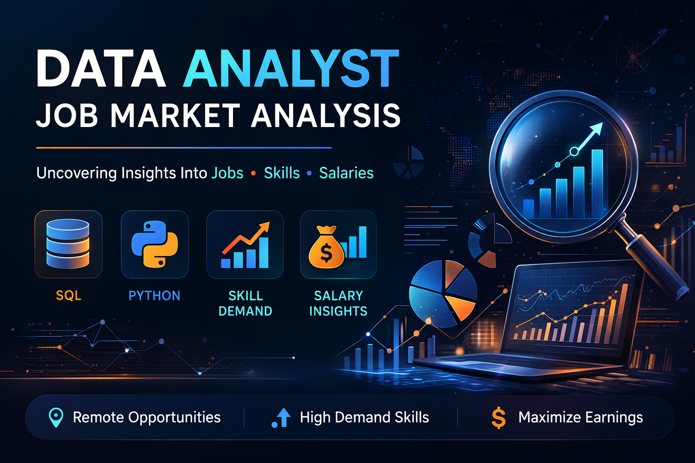
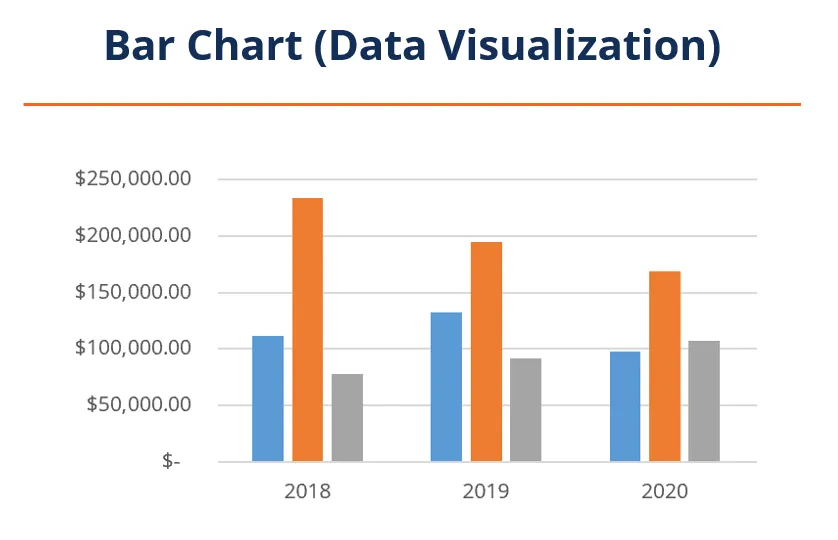

<p align="center">
  
</p>

# 📊 Data Analyst Job Market Analysis


## Introduction
Dive into the data job market! This project explores:

- 💰 Top-paying data analyst jobs
- 📈 In-demand skills
- 🔎 Skills associated with higher salaries
- 🎯 Optimal skills for data analysts to learn

All insights were derived using **SQL queries** on a dataset of job postings.

SQL queries used in this project can be found here:  
📂 [project_sql_folder](/project_sql/)

## Background

Driven by a desire to understand the data analyst job market, this project analyzes job postings to identify:

- Top paying data analyst roles
- Skills required for those roles
- Most in-demand skills
- Skills associated with higher salaries
- Optimal skills for career growth


## 📑 Table of Contents

- [Introduction](#introduction)
- [Tools Used](#tools-used)
- [The Analysis](#the-analysis)
- [Top Paying Jobs](#1️⃣-top-paying-data-analyst-jobs)
- [Top Paying Job Skills](#2️⃣-what-skills-are-required-for-these-top-paying-jobs)
- [Top Demanding Skills](#3️⃣-what-skills-are-most-in-demand-for-data-analysts)
- [Top Paying Skills](#4️⃣-what-skills-are-associated-with-higher-salaries)
- [Optimal Skills](#5️⃣-what-are-the-most-optimal-skills-to-learn)
- [What I Learned](#-what-i-learned)
- [Conclusions](#-conclusions)

## Questions Answered

1. What are the **top-paying data analyst jobs**?
2. What **skills are required** for these jobs?
3. What **skills are most in demand**?
4. Which **skills have the highest salaries**?
5. What are the **most optimal skills to learn**?

## Tools I Used

For my deep dive into the data analyst job market, I harnessed the power of several key tools:

- **SQL:** The backbone of my analysis, allowing me to query the database and unearth critical insights.

- **PostgreSQL:** The chosen database management system, ideal for handling the job posting data.

- **Visual Studio Code:** My go-to for database management and executing SQL queries.

- **Git & GitHub:** Essential for version control and sharing my SQL scripts and analysis, ensuring collaboration and project tracking.  


# The Analysis

 Each query investigates a specific aspect of the data analyst job market.

# 1️⃣ Top Paying Data Analyst Jobs

## This query identifies the highest paying data analyst roles.

``` sql
SELECT
    job_id,
    job_title,
    job_location,
    salary_year_avg,
    name AS company_name
FROM job_postings_fact
LEFT JOIN company_dim
    ON job_postings_fact.company_id = company_dim.company_id
WHERE
    job_title_short = 'Data Analyst'
    AND job_location = 'Anywhere'
    AND salary_year_avg IS NOT NULL
ORDER BY
    salary_year_avg DESC
LIMIT 10;
```
### 🔎 Breakdown

- **Remote data analyst jobs dominate the top paying roles**, showing that companies are willing to pay premium salaries for remote analytical expertise.

- **Salary range varies significantly**, with the top roles exceeding **$200,000 per year**, indicating strong earning potential in the field.

- **Large tech and data-driven companies appear frequently**, suggesting organizations that rely heavily on data analytics offer higher compensation.

### 📌 Key Takeaway

The highest paying data analyst roles are often **remote positions in data-driven organizations**, offering competitive salaries for candidates with strong analytical skills.



*ChatGPT generated this graph from my SQL query results*

# 2️⃣ What Skills Are Required for These Top Paying Jobs?

## To understand which skills are required for the highest paying data analyst roles, the following SQL query joins the job postings with the skills tables.
``` sql
WITH top_paying_jobs AS (
    SELECT
        job_id,
        job_title,
        salary_year_avg,
        name AS company_name
    FROM job_postings_fact
    LEFT JOIN company_dim 
        ON job_postings_fact.company_id = company_dim.company_id
    WHERE
        job_title_short = 'Data Analyst'
        AND job_location = 'Anywhere'
        AND salary_year_avg IS NOT NULL
    ORDER BY salary_year_avg DESC
    LIMIT 10
)

SELECT
    top_paying_jobs.*,
    skills
FROM top_paying_jobs
INNER JOIN skills_job_dim
    ON top_paying_jobs.job_id = skills_job_dim.job_id
INNER JOIN skills_dim
    ON skills_job_dim.skill_id = skills_dim.skill_id
ORDER BY salary_year_avg DESC;
```
### 🔎 Breakdown

- **SQL appears in nearly every top paying role**, confirming it as the core skill required for data analysis jobs.

- **Python and R are frequently mentioned**, highlighting the importance of programming skills in high-paying analytics roles.

- **Visualization tools such as Tableau and Power BI** are common among these jobs, emphasizing the need to communicate insights effectively.

### 📌 Key Takeaway

Top paying data analyst jobs require a **combination of data querying, programming, and visualization skills**.


# 3️⃣ What Skills Are Most In Demand for Data Analysts?

## This query identifies the most frequently requested skills in data analyst job postings.
``` sql
SELECT 
    skills,
    COUNT(skills_job_dim.job_id) AS demand_count
FROM job_postings_fact
INNER JOIN skills_job_dim
    ON job_postings_fact.job_id = skills_job_dim.job_id
INNER JOIN skills_dim
    ON skills_job_dim.skill_id = skills_dim.skill_id
WHERE
    job_title_short = 'Data Analyst'
GROUP BY
    skills
ORDER BY
    demand_count DESC
LIMIT 10;
```

### 🔎 Breakdown

- **SQL is the most demanded skill**, appearing in the largest number of job postings.

- **Python ranks among the top demanded skills**, reflecting its widespread use in data analysis and automation.

- **Excel remains highly requested**, demonstrating that traditional spreadsheet tools still play an important role in analytics.

### 📌 Key Takeaway

Employers consistently prioritize **SQL, Python, and Excel** when hiring data analysts.


# 4️⃣ What Skills Are Associated With Higher Salaries?

## This query calculates the average salary associated with each skill.
``` sql
SELECT
    skills,
    ROUND(AVG(salary_year_avg),0) AS avg_salary
FROM job_postings_fact
INNER JOIN skills_job_dim
    ON job_postings_fact.job_id = skills_job_dim.job_id
INNER JOIN skills_dim
    ON skills_job_dim.skill_id = skills_dim.skill_id
WHERE
    job_title_short = 'Data Analyst'
    AND salary_year_avg IS NOT NULL
GROUP BY
    skills
ORDER BY
    avg_salary DESC
LIMIT 25;
```
### 🔎 Breakdown

- **Specialized tools command higher salaries**, as fewer professionals possess expertise in these technologies.

- **Machine learning frameworks and advanced analytics tools** tend to be associated with higher compensation.

- **Emerging technologies in data infrastructure** also show strong salary potential.

### 📌 Key Takeaway

Developing expertise in **advanced analytics tools and modern data technologies** can significantly increase earning potential.


# 5️⃣ What Are the Most Optimal Skills to Learn?

## Optimal skills are those that are both high in demand and offer high salaries.
``` sql
WITH skills_demand AS(
    SELECT 
        skills,
        skills_job_dim.skill_id,
        COUNT(skills_job_dim.job_id) AS demand_count
    FROM job_postings_fact
    INNER JOIN skills_job_dim 
        ON job_postings_fact.job_id = skills_job_dim.job_id
    INNER JOIN skills_dim 
        ON skills_job_dim.skill_id = skills_dim.skill_id
    WHERE
        job_title_short = 'Data Analyst'
        AND salary_year_avg IS NOT NULL
    GROUP BY
        skills,
        skills_job_dim.skill_id
),

average_salary AS(
    SELECT 
        skills,
        skills_job_dim.skill_id,
        ROUND(AVG(salary_year_avg),0) AS avg_salary
    FROM job_postings_fact
    INNER JOIN skills_job_dim 
        ON job_postings_fact.job_id = skills_job_dim.job_id
    INNER JOIN skills_dim 
        ON skills_job_dim.skill_id = skills_dim.skill_id
    WHERE
        job_title_short = 'Data Analyst'
        AND salary_year_avg IS NOT NULL
    GROUP BY
        skills,
        skills_job_dim.skill_id
)

SELECT
    skills_demand.skills,
    demand_count,
    avg_salary
FROM skills_demand
INNER JOIN average_salary
    ON skills_demand.skill_id = average_salary.skill_id
ORDER BY
    avg_salary DESC;
```
### 🔎 Breakdown

- The most optimal skills combine **high demand with strong salary potential**.

- **SQL stands out as both highly demanded and well-paid**, making it one of the most valuable skills for data analysts.

- **Python and data visualization tools** also appear in the optimal skill set due to their balance of demand and compensation.

### 📌 Key Takeaway

Focusing on skills that balance **market demand and salary potential** provides the best career growth opportunities for data analysts.


# 📚 What I Learned

This project strengthened my ability to analyze real-world datasets using SQL.

Key improvements include:

- Writing complex SQL queries
- Using joins to combine multiple tables
- Performing aggregations with GROUP BY
- Extracting insights from large datasets

---

# 📈 Conclusions

1. **Top paying jobs** offer strong salaries for experienced analysts.
2. **SQL remains the most important skill** in the job market.
3. **Python and visualization tools enhance employability.**
4. **Advanced technical skills increase earning potential.**

---

# 🚀 Final Thoughts

Understanding job market trends helps data analysts prioritize the most valuable skills and make informed career decisions.


