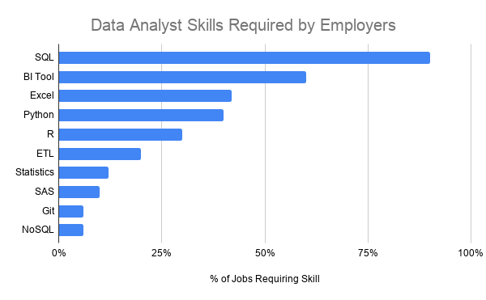

# 📊 Data Analyst Job Market Analysis (SQL Project)

## Introduction
Dive into the data job market! This project explores:

- 💰 Top-paying data analyst jobs
- 📈 In-demand skills
- 🔎 Skills associated with higher salaries
- 🎯 Optimal skills for data analysts to learn

All insights were derived using **SQL queries** on a dataset of job postings.

SQL queries used in this project can be found here:  
📂 [project_sql_folder](/project_sql/)

## Background

Driven by a desire to understand the data analyst job market, this project analyzes job postings to identify:

- Top paying data analyst roles
- Skills required for those roles
- Most in-demand skills
- Skills associated with higher salaries
- Optimal skills for career growth

## Questions Answered

1. What are the **top-paying data analyst jobs**?
2. What **skills are required** for these jobs?
3. What **skills are most in demand**?
4. Which **skills have the highest salaries**?
5. What are the **most optimal skills to learn**?

# Tools I Used

For my deep dive into the data analyst job market, I harnessed the power of several key tools:

- **SQL:** The backbone of my analysis, allowing me to query the database and unearth critical insights.

- **PostgreSQL:** The chosen database management system, ideal for handling the job posting data.

- **Visual Studio Code:** My go-to for database management and executing SQL queries.

- **Git & GitHub:** Essential for version control and sharing my SQL scripts and analysis, ensuring collaboration and project tracking.  

# The Analysis
Each query investigates a specific aspect of the data analyst job market.

## 1️⃣ Top Paying Data Analyst Jobs

This query identifies the highest paying data analyst roles.

```sql
SELECT
    job_id,
    job_title,
    job_location,
    salary_year_avg,
    name AS company_name
FROM job_postings_fact
LEFT JOIN company_dim
    ON job_postings_fact.company_id = company_dim.company_id
WHERE
    job_title_short = 'Data Analyst'
    AND job_location = 'Anywhere'
    AND salary_year_avg IS NOT NULL
ORDER BY
    salary_year_avg DESC
LIMIT 10;

